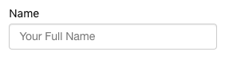
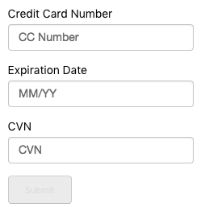
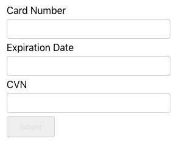
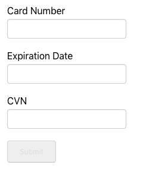

# vindicia-pmt-react

A React.js wrapper component for the Vindicia Payment Method Tokenization (PMT) system. Use this component to wrap a form containing payment details to use the Vindicia PMT system. The form can either be constructed by the component or passed in via `children` prop.

---

# Table of Contents
- [vindicia-pmt-react](#vindicia-pmt-react)
- [Table of Contents](#table-of-contents)
- [Demo](#demo)
- [Setup](#setup)
- [Quickstart](#quickstart)
- [Props](#props)
  - [vindicia](#vindicia)
  - [options](#options)
  - [fields](#fields)
    - [Method 1 - Construct text field](#method-1---construct-text-field)
    - [Method 2 - Construct vindicia field](#method-2---construct-vindicia-field)
    - [Method 3 - Pass in jsx](#method-3---pass-in-jsx)
  - [styles](#styles)
  - [onVindiciaFieldEvent](#onvindiciafieldevent)
  - [onSubmitEvent](#onsubmitevent)
  - [onSubmitCompleteEvent](#onsubmitcompleteevent)
  - [onSubmitCompleteFailedEvent](#onsubmitcompletefailedevent)
  - [Hidden Fields](#hidden-fields)
- [How to](#how-to)
  - [Create your form](#create-your-form)
  - [Style your form](#style-your-form)

---

# Demo

1. Install vindicia-pmt-react locally\
`npm install vindicia-pmt-react`

2. Run demo start script\
`npm run demo`

3. Open demo in browser at [http://localhost:8080](http://localhost:8080)

---

# Setup

1. Install vindicia-pmt-react\
`npm install vindicia-pmt-react`

2. Add Vindicia to application\
`<script id="vindicia-js" src="https://secure.vindicia.com/pmt/vindicia.js" async></script>`
  
---
# Quickstart

1.  Import VindiciaFormWrapper to your component\
`import VindiciaFormWrapper from 'vindicia-react';`

1. Add VindiciaFormWrapper to the component
	```javascript
    <VindiciaFormWrapper
      vindicia={window.vindicia}
      options={
        {
          vindiciaAuthId: 'your-auth-id',
          vindiciaServer: 'secure.vindicia.com',
          vindiciaRestServer: 'api.vindicia.com',
          hmac: 'your-hmac'
        }
      }
      onSubmitCompleteEvent={(e) => console.log('Form submit success!', e)}
    />
	```
---
# Props

|Prop|Required?
|--|--|
|[vindicia](#vindicia)|yes
|[options](#options)|yes
|[fields](#fields)|no
|[styles](#styles)|no
|[onVindiciaFieldEvent](#onVindiciaFieldEvent)|no
|[onSubmitEvent](#onSubmitEvent)|no
|[onSubmitCompleteEvent](#onSubmitCompleteEvent)|no
|[onSubmitCompleteFailedEvent](#onSubmitCompleteFailedEvent)|no
|[vinValidate](#Hidden-Fields)|no
|[currency](#Hidden-Fields)|no
|[ignoreCvnPolicy](#Hidden-Fields)|no
|[minChargebackProb](#Hidden-Fields)|no
|[sourceIp](#Hidden-Fields)|no
|[ignoreAvsPolicy](#Hidden-Fields)|no

---

## vindicia

The Vindicia object, from `vindicia.js`.

You can access this by adding

`<script id="vindicia-js" src="https://secure.vindicia.com/pmt/vindicia.js" async></script>`

to your index.html and either pulling it straight from the global variable `window.vindicia` or binding it to state on load.

Below is an example which uses an event listener in `componentWillMount`:

```javascript
componentWillMount() {
  if (window.vindicia) {
    this.setState({vindicia: window.vindicia});
  } else {
    document.querySelector('#vindicia-js').addEventListener('load', () => {
      this.setState({vindicia: window.vindicia});
    });
  }
}
```

---

## options

The options settings are fairly straightforward.

```javascript
{
  formId: 'mainForm', // optional, defaults to 'mainForm'
  vindiciaAuthId: 'your-auth-id', // required
  hmac: "your-hmac", // required
  vindiciaServer: "secure.vindicia.com", // required, to load the iframes from
  vindiciaRestServer: "api.vindicia.com", // required, to submit the JSON data to
  iframeHeightPadding: 0, // optional, defaults to 0
}
```
---
## fields

`fields` is an array of objects, each corresponding to an item on the final form.

Here is a rundown of the available fields on the field objects:

|property|default|purpose|notes|
|--|--|--|--|
|type|`text`|determines type of field|accepts `'text'`, or one of the [vindicia field](#method-2---construct-vindicia-field) values|
|label|`null`|creates `<label>` for given field||
|placeholder|`''`|adds `placeholder` attribute on form fields||
|render|`null`|pass JSX to be displayed on form|overrides any constructed field logic|
|format|`null`|only used on expirationDate||
|value|`''`|default value of form field||
|name|`null`| applies HTML ID to form element||
|autocomplete|`'off'`|Makes use of the browser's autofill feature|Used with `cardNumber`, `expirationDate`, and `cvn`|
|formatinput|`false`||Used with `cardNumber` and `expirationDate`||
|maskinput|`false`||Used with `cardNumber` or `cvn`||

There are several ways to leverage `fields`, outlined below:

---

### Method 1 - Construct text field

Passing in the following:
```javascript
{
	type:  'text',
	label:  'Name',
	placeholder:  'Your Full Name',
	name:  'name'
},
```
Will result in:



---

### Method 2 - Construct vindicia field

The following fields are able to be created within Vindicia, which creates an iframe to enhance security. Setting a field's `type` to any of these will result in Vindicia handling the creation and validation of that field.

|Field Name|CSS Selector|Notes|
|--|--|--|
|name|#vin_account_holder
|billing1|#vin_billing_address_line1
|billing2|#vin_billing_address_line2
|billing3|#vin_billing_address_line3
|city|#vin_billing_city
|district|#vin_billing_address_district|Equivalent to US state|
|postalCode|#vin_billing_address_postal_code
|country|#vin_billing_address_country
|phone|#vin_billing_address_phone
|cardNumber|#vin_credit_card_account
|expirationDate|#vin_credit_card_expiration_date
|expirationMonth|#vin_credit_card_expiration_month|May be used alongside `expirationYear` instead of `expirationDate`
|expirationYear|#vin_credit_card_expiration_year
|cvn|#vin_credit_card_cvn

For a pure credit card entry form, the simplest way forward is to use Vindicia-constructed fields.  This essentially gives Vindicia full control (aside from styling) of your form.

Using the following `fields` setup:
```javascript
const fields = [
  {
    type: 'cardNumber',
    label: 'Credit Card Number',
    placeholder: 'CC Number',
    autocomplete: 'cc-number',
    formatinput: true,
    maskinput: true
  },
  {
    type: 'expirationDate',
    label: 'Expiration Date',
    placeholder: 'MM/YY',
    format: 'MM/YY',
    autocomplete: 'cc-exp',
    formatinput: true,
    maskinput: true
  },
  {
    type: 'cvn',
    label: 'CVN',
    placeholder: 'CVN',
    autocomplete: 'cc-csc'
  },
];
```
Will result in:



---

### Method 3 - Pass in jsx

Use of the `render` property allows for the passing in of JSX. This JSX can be a form field, a	`<div>`, or a custom component.

Example of the use of the render property:
```javascript
{
  render: (
    <div className="text-block">
    <p>This is a text block that is passed from the parent. Styles can be applied via the styles prop.</p>
    </div>
  )
},
{
  label:  'Address',
  render: (
    <input
      type="text"
      id="address"
      required
    />
  ),
  name:  'address'
},
{
  render: (
    <MyComponent />
  )
}
```

Note that in the first example, no properties other than `render` are passed in, while in the second example, `label` and `name` are passed. This is to ensure the `<label>` is created and synced with the `<input>` field via use of the `name` property which sets the `htmlFor` attribute on the `<label>`.

---

## styles

The `styles` prop is what can be passed in to apply CSS styles to the form wrapper.

Any style may be passed in and will affect any element of the generated form EXCEPT for protected fields within a Vindicia-generated iframe. For those fields ([listed here](#method-2---construct-vindicia-field)), CSS is limited to the following rules:
```
color
width
height
border
border-color
border-radius
font
font-family
font-size
font-size-adjust
font-stretch
font-style
font-variant
font-variant-alternates
font-variant-caps
font-variant-east-asian
font-variant-ligatures
font-variant-numeric
font-weight
line-height
opacity
outline
padding
margin
text-shadow
box-shadow
-webkit-box-shadow
-moz-osx-font-smoothing
-moz-transition
-webkit-font-smoothing
-webkit-transition
transition
```

---

## onVindiciaFieldEvent

`onVindiciaFieldEvent` is called when an onBlur event fires from a Vindicia-generated field. Note this function is not called when a constructed or passed-in field is modified.

---

## onSubmitEvent

`onSubmitEvent` fires when the submit button is clicked, but before data is submitted. This is your chance to run validation on the form's inputs.

It is important to note, that when using `onSubmitEvent` for validation, you must return `true` if the data is in fact valid, otherwise the data will not be sent to Vindicia for validation.

---

## onSubmitCompleteEvent

`onSubmitCompleteEvent` is called when the form has been submitted and validated successfully. This is where you would proceed with your checkout process, e.g. route the user to a success page.

---

## onSubmitCompleteFailedEvent

`onSubmitCompleteFailedEvent` is called when the form has been submitted but fails server validation.

---

## Hidden Fields

There are several hidden fields which are configurable. None are required for use, but the option to change them as needed is available. More information regarding these hidden fields are available in the Vindicia PMT documentation.

The hidden fields which are configurable are:

- `vin_validate`
- `vin_ignore_avs_policy`
- `vin_ignore_cvn_policy`
- `vin_min_chargeback_probability`
- `vin_source_ip`
- `vin_currency`

An example of how to use them is below:

```javascript
<VindiciaFormWrapper
  vindicia={vindicia}
  options={vindiciaOptions}
  vinValidate="0"
  currency="EUR"
  ignoreCvnPolicy={true}
  ignoreAvsPolicy={true}
  minChargebackProb="100"
  sourceIp="12.243.28.45"
/>
```

These all correspond to the hidden fields listed below:

```html
<input name="vin_validate" value="0" type="hidden" />
<input name="vin_ignore_avs_policy" value="1" type="hidden" />
<input name="vin_ignore_cvn_policy" value="1" type="hidden" />
<input name="vin_min_chargeback_probability" value="100" type="hidden" />
<input name="vin_source_ip" value="12.243.28.45" type="hidden" />
<input name="vin_currency" value="EUR" type="hidden" />
```

---

# How to
## Create your form

There are three methods to creating your form. You can:

1. Use the `fields` prop to pass in each field or JSX element, one after the other. For more information, see the [fields documentation](#fields) above.
2. Pass in your own form as a child element, i.e.
	```javascript
    <VindiciaFormWrapper
      vindicia={vindicia}
      options={vindiciaOptions}
      styles={styles}
    >
      <div className="your-form">
        <div class="form-group">
          <label for="vin_credit_card_account">Card Number</label>
          <div id="vin_credit_card_account"></div>
        </div>
        <div class="form-group">
          <label for="vin_credit_card_expiration_date">Expiration Date</label>
          <div id="vin_credit_card_expiration_date"></div>
        </div>
        <div class="form-group">
          <label for="vin_credit_card_account">CVN</label>
          <div id="vin_credit_card_account"></div>
        </div>
        <button type="submit" disabled={!vindicia.isValid()}>Submit</button>
      </div>
    </VindiciaFormWrapper>
	```
    Resulting in:\
    

3. Pass in no children or `fields` prop, and a form will be created that has fields for `card number`, `expiration date`, and `cvn`. The following will be enough to create your form, though you may want to add handlers for the `submitComplete` events.
	```javascript
    <VindiciaFormWrapper
      vindicia={vindicia}
      options={vindiciaOptions}
    />
	```
    Resulting in:\
    

## Style your form

`VindiciaFormWrapper` is quite customizable as far as styling goes. This is an example style object passed in via the `style` prop:
```javascript
const style = {
  input: {
    width: '200px',
    display: 'block',
    'font-family': '"Helvetica Neue",Helvetica,Arial,sans-serif',
    'font-size': '14px',
    color: '#777',
    height: 'auto',
    padding: '6px 12px',
    margin: '5px 0px 20px 0px',
    'line-height': '1.42857',
    border: '1px solid #ccc',
    'border-radius': '4px',
    'box-shadow': '0px 1px 1px rgba(0,0,0,0.075) inset',
    '-webkit-transition': 'border-color 0.15s ease-in-out 0s, box-shadow 0.15s ease-in-out 0s',
    transition: 'border-color 0.15s ease-in-out 0s, box-shadow 0.15s ease-in-out 0s',
  },
  select: {
    width: '100%',
    'font-family': "'Helvetica Neue',Helvetica,Arial,sans-serif",
    'font-size': '14px',
    color: '#555',
    height: '34px',
    padding: '6px 12px',
    margin: '5px 0px',
    'line-height': '1.42857',
    border: '1px solid #ccc',
    'border-radius': '4px',
    'box-shadow': '0px 1px 1px rgba(0,0,0,0.075) inset',
    '-webkit-transition': 'border-color 0.15s ease-in-out 0s, box-shadow 0.15s ease-in-out 0s',
    transition: 'border-color 0.15s ease-in-out 0s, box-shadow 0.15s ease-in-out 0s',
  },
  ':focus': {
    'border-color': '#66afe9',
    outline: '0',
    '-webkit-box-shadow': 'inset 0 1px 1px rgba(0,0,0,.075), 0 0 8px rgba(102, 175, 233, .6)',
    'box-shadow': 'inset 0 1px 1px rgba(0,0,0,.075), 0 0 8px rgba(102, 175, 233, .6)',
  },
  '.valid': {
    'border-color': '#228B22',
  },
  '.notValid': {
    'border-color': '#ff0000',
  },
  '.text-block': {
    padding: '10px',
    'background-color': '#ccc',
    width: '300px',
  },
  'button[type="submit"]': {
    padding: '10px 20px',
    'background-color': '#ccc',
    color: '#444',
    'border-radius': '4px',
    'font-size': '12px',
  },
  'button[type="submit"][disabled]': {
    'background-color': '#eee',
    color: '#ddd',
  },
}
```
